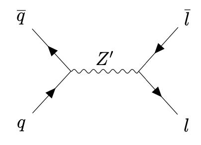

### Phenomenological study of Z' boson search at LHC in final states of same flavored leptons.
This repository contains the necessary python code (+ root files) to perform a preliminary phenomenological study of Z' gauge boson production in lepton desintegration, using computer simulations of the Drell-Yan (DY) mechanism, at the Large Hadron Collider, LHC. 
The Feynman diagram for the Drell-Yan Z' boson production is shown below:

In this process, the annihilation of a quark-antiquark pair produces a heavy Z' boson that, finally, decays into a lepton-antilepton pair. 